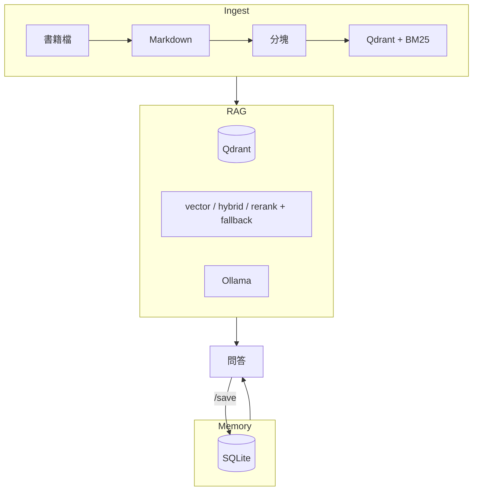
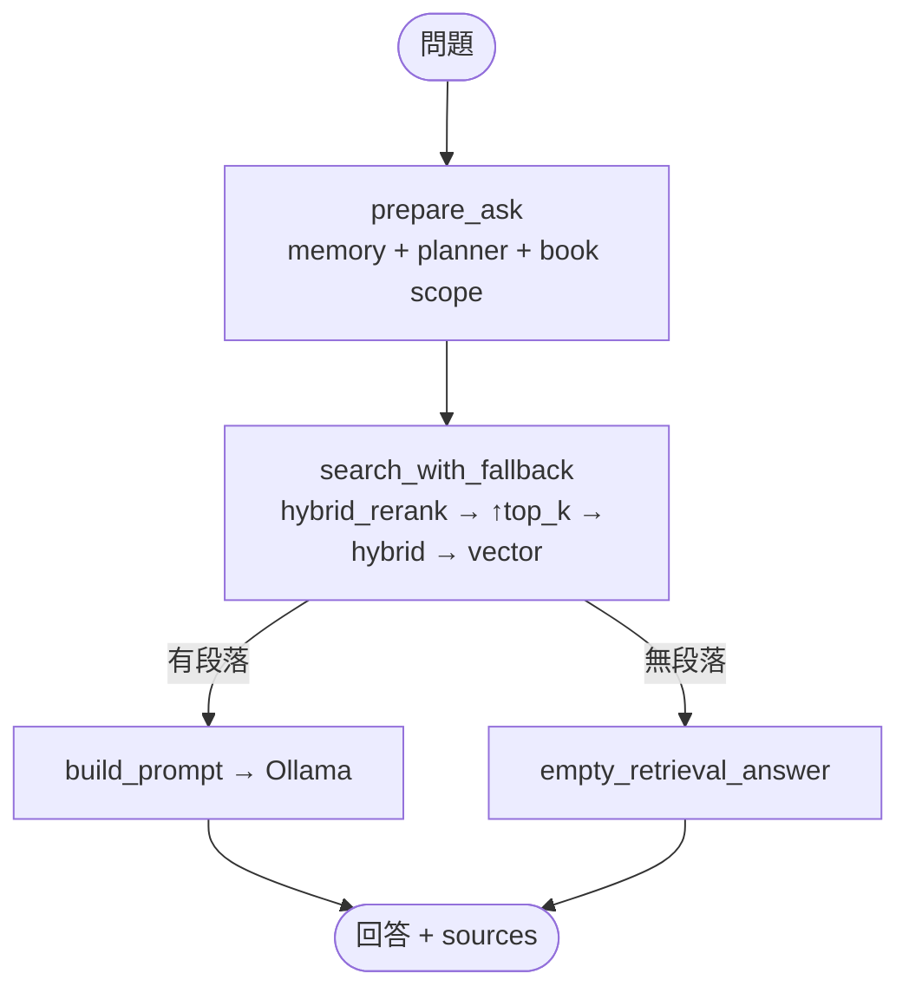

# Book Spirit — 架構

> 審閱指南：[docs/REVIEW.md](docs/REVIEW.md)  
> 安裝與快速開始：[README.md](README.md)  
> 技術取捨筆記：[docs/LEARNING.md](docs/LEARNING.md)  
> Chat 指令：[QUICKSTART_READING.md](QUICKSTART_READING.md)

## 定位

個人 RAG 練習專案：書籍入庫 → 檢索 → Ollama 問答 → SQLite 筆記。  
主線：`build_index.py` → `chat.py`（或 API）→ `/save`。

---

## 三層



重建 Qdrant / 換 embedding **不刪** SQLite 筆記。

---

## 問答路徑



- **LangGraph：** `integrations/langgraph.py`（預設 backend，履歷可講「圖編排」）
- **共用邏輯：** `core/ask_orchestrator.py`、`core/ask_flow.py`
- **Native：** `core/pipeline.py` 的 `NativeRAG`
- **檢索入口：** `core/retrieval_service.py` → `core/retrieve_fallback.py`

---

## 目錄

```
book-spirit/
├── core/
│   ├── pipeline.py          # NativeRAG：向量檢索 + Ollama
│   ├── ask_orchestrator.py  # run_ask / retrieve / generate 共用
│   ├── ask_flow.py          # prepare_ask、低信心提示
│   ├── retrieval_service.py # search_once / search_with_fallback
│   ├── retrieve_fallback.py # 檢索降級梯子
│   ├── hybrid.py / rerank.py
│   ├── index_catalog.py     # index_meta、BM25 路徑（唯讀）
│   └── library_scope.py     # book_id / 多書 scope
├── ingest/                  # converter, chunker, indexer
├── memory/                  # SQLite
├── eval/                    # golden + 互動評測
├── api/                     # FastAPI
├── integrations/            # langchain / langgraph 薄包裝
└── scripts/                 # build_index, chat, eval
```

---

## 技術選型

| 項目 | 選擇 |
|------|------|
| 解析 | MarkItDown（預設）；PDF 可選 MinerU |
| 分塊 | 自研 `chunker.py`（`semantic` / `native`） |
| Embedding | BGE-small-zh |
| 向量庫 | Qdrant 本地，每書一 collection |
| 檢索 | hybrid + rerank + fallback |
| 生成 | Ollama |
| 筆記 | SQLite |

---

## 刻意不做

- 多使用者 / 權限
- 用 LangChain 重寫 ingest
- 一次答完整本書（top-k 片段 RAG 的限制）
