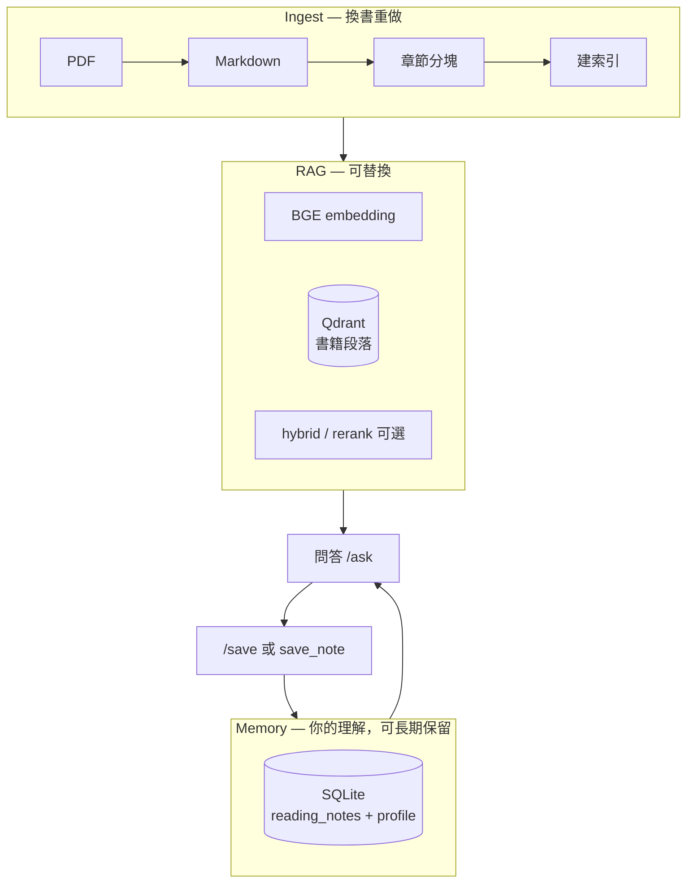

# Book Spirit — 架構與定位

## 這個專案是什麼（先講清楚）

Book Spirit 是 **個人用的 RAG toy**：用來**快速理解一本書**、在問答裡釐清概念、把內化成自己的話存進 **Memory**；同時作為求職作品，展示 **可替換的檢索層 + 量化評測 + 工程取捨**。

它不是：

- 要比 NotebookLM 更好用的閱讀 App  
- 要以 LangChain 為核心的產品  
- 已完成的多書內容工廠（發讀書片段是**下一步**）

它是：

- **理解 → 問答 → `/save` 記憶** 的本地閉環  
- 讓你親手碰過：分塊、embedding、向量庫、檢索、生成、eval  
- 對外（面試）用同一套 repo 講 **系統設計**，對內當 **學習實驗台**

---

## 兩條敘事（不要混在一起講）

| | **對內（你自己）** | **對外（面試 / README 頂部）** |
|--|--|--|
| 目標 | 讀懂、記住、累積經驗 | RAG pipeline + memory 分層 + eval |
| 「拆書」 | AI 依章節分塊後，用問答幫你**理解**（不是為了發文而拆） | Ingest：PDF → 結構化 chunk → Qdrant |
| 成功標準 | 問得懂、筆記越積越多 | 能畫架構圖、能講為何不用 LC 當核心 |
| 發內容 | 之後從 Memory + 書摘生成草稿（Phase C） | 可選延伸，非 MVP |

---

## 三層模型（面試主圖）



**換 embedding / 重建 Qdrant**：只動 **ingest + rag**；**SQLite 筆記不刪**。  
這是「自研」相對現成工具的主要意義——**沉澱的是你的經驗，不是某次對話 session**。

---

## 個人使用流程（C：理解優先）

1. **建索引（一次）** — `scripts/build_index.py`（書進 Qdrant）  
2. **問答理解** — `scripts/chat.py` 或 `/ask`（AI 依段落回答 + 引用）  
3. **內化** — 答得好 → `/save`（進 SQLite）  
4. **越聊越熟** — 下次問題會帶相關筆記 + profile  
5. **（規劃）發片段** — 從筆記 + 書摘生成貼文草稿，grounded 在 top-k  

詳細指令見 [QUICKSTART_READING.md](QUICKSTART_READING.md)。

---

## 目錄結構

```
book-spirit/
├── core/                 # RAG 核心（config, pipeline, hybrid, rerank）
├── ingest/               # PDF → MD → chunk → Qdrant
├── memory/               # SQLite 讀書筆記
├── eval/                 # 檢索品質評測
├── api/                  # FastAPI（python -m api）
├── integrations/         # LangChain / LangGraph（可選）
├── scripts/
│   ├── build_index.py    # 建索引
│   ├── chat.py           # 問答 + /save
│   ├── eval.py           # 評測
│   └── notes_cli.py      # 筆記 CLI（進階）
└── tests/
```

| 層 | 套件 | 入口 |
|----|------|------|
| Ingest | `ingest/` | `scripts/build_index.py` |
| RAG | `core/` | `core.pipeline.NativeRAG` |
| Memory | `memory/` | `scripts/chat.py` 內 `/save` |
| API | `api/` | `uv run python -m api` |
| Eval | `eval/` | `scripts/eval.py` |
| Integrations | `integrations/` | API `backend=langchain` |

**核心路徑永遠是 `core.pipeline`**；integrations 僅委派 `NativeRAG`。

---

## 面試怎麼講（B：30 秒 + 追問）

**開場：**

> 「這是一個 **swappable RAG stack** 上的 **personal reading memory**。書的向量索引可以重建；使用者筆記在 SQLite，不跟 embedding 版本綁死。我分離檢索與生成，用固定題集評估檢索層，避免把 LLM 錯誤算成檢索問題。」

**常見追問：**

| 問題 | 建議回答 |
|------|----------|
| 為何不用 LangChain 當核心？ | 分塊與中文書結構要自控；LC 放在 integrations 做對照即可 |
| 為何 sentence-transformers + Ollama？ | 前者做向量檢索；後者做生成——任務不同 |
| 為何 SQLite + Qdrant？ | Qdrant 存書；SQLite 存「我」的理解——職責分離 |
| hybrid/rerank 價值？ | 進階實驗，用 eval 對照 vector baseline |
| 和 NotebookLM 差異？ | 他們快；我這邊重 **本地、可換層、可累積 memory、可量測** |

**關鍵字（履歷一行）：** RAG · Vector DB · FastAPI · retrieval eval · grounded generation · local LLM · system design

---

## 技術決策摘要

| 決策 | 選擇 | 不選 / 晚點再做 |
|------|------|----------------|
| 向量庫 | Qdrant 本地 | 上雲（Phase 4 暫緩） |
| Embedding | BGE-small-zh + `query:` 前綴 | 雲端 embed API |
| 生成 | Ollama 本地 | 雲端 GPU |
| 個人記憶 | SQLite | 一開始就 Postgres 存筆記 |
| 查詢 log | Postgres（可選） | 與 memory 混淆 |
| 框架 | native 核心 | 全棧 LangChain |
| 評測 | 固定題 + 人工 precision@k | 端到端 LLM 評分當主指標 |

---

## 刻意不做（控制 scope）

- 多使用者 / 權限  
- 自動發社群、排程  
- 筆記向量檢索（多書後再考慮）  
- 以 LangChain 重寫 ingest  

---

## 文件地圖

| 文件 | 讀者 |
|------|------|
| [README.md](README.md) | 面試官 / 第一次進 repo |
| [QUICKSTART_READING.md](QUICKSTART_READING.md) | 你自己日常用 |
| [ARCHITECTURE.md](ARCHITECTURE.md) | 本檔 — 定位 + 面試話術 |
| [docs/DEPLOYMENT.md](docs/DEPLOYMENT.md) | Docker / CI / Postgres log |
| [Todo.md](Todo.md) | 實作進度 |
