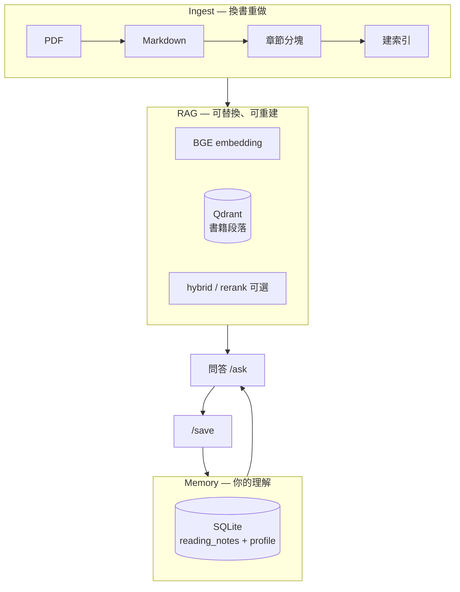

# Book Spirit — 架構與定位

## 這是什麼

**Book Spirit** 是我自己做來**理解 RAG** 的本地 toy：把 PDF 拆成段落、建向量索引、用檢索 + 本地 LLM 問答，再把內化後的理解存進 **SQLite Memory**。

它不是產品，也不追求取代任何現成閱讀工具。

**主線：** 建索引 → 問答（附引用）→ `/save` 筆記 → 下次帶著筆記再問。

**你會親手碰到的環節：** 分塊、embedding、Qdrant、BM25/hybrid（可選）、檢索評測、生成 prompt。

---

## 三層模型



換 embedding 或重建 Qdrant 只動 **ingest + rag**；**SQLite 筆記保留**。

---

## 日常使用

見 [QUICKSTART_READING.md](QUICKSTART_READING.md)。

1. `scripts/build_index.py` — PDF → chunk → Qdrant + BM25  
2. `scripts/chat.py` — 問答、`/book`、`/save`  
3. （可選）`scripts/eval.py` — 固定題測檢索，不混 LLM 幻覺  
4. （可選）`python -m api` — FastAPI 同一套 pipeline  

---

## 目錄結構

```
book-spirit/
├── core/           # pipeline、hybrid、rerank、query planner
├── ingest/         # PDF → MD → chunk → index
├── memory/         # SQLite 筆記
├── eval/           # 檢索評測
├── api/            # FastAPI
├── integrations/   # LangChain / LangGraph（可選對照）
├── scripts/        # build_index, chat, eval, notes_cli
└── tests/
```

核心路徑永遠是 `core.pipeline.NativeRAG`；integrations 僅委派 native。

---

## 技術決策（簡表）

| 項目 | 選擇 |
|------|------|
| 向量庫 | Qdrant 本地 |
| Embedding | BGE-small-zh（查詢加 `query:` 前綴） |
| 生成 | Ollama 本地 |
| 個人記憶 | SQLite（與向量索引分離） |
| 可選 | hybrid、rerank、query planner |
| 評測 | precision@k 類檢索題，非端到端 LLM 打分 |

---

## 刻意不做

- 多使用者 / 權限  
- 自動發社群  
- 全書人物傳記式一次答完（top-k 片段 RAG 的取捨）  
- 以 LangChain 重寫 ingest  

---

## 文件地圖

| 文件 | 用途 |
|------|------|
| [README.md](README.md) | 安裝、API、技術說明 |
| [QUICKSTART_READING.md](QUICKSTART_READING.md) | 讀書流程 |
| [docs/DEPLOYMENT.md](docs/DEPLOYMENT.md) | Docker / CI |
| [OLLAMA_SETUP.md](OLLAMA_SETUP.md) | 本地模型 |
| [Todo.md](Todo.md) | 個人實作筆記（不進 Git） |
