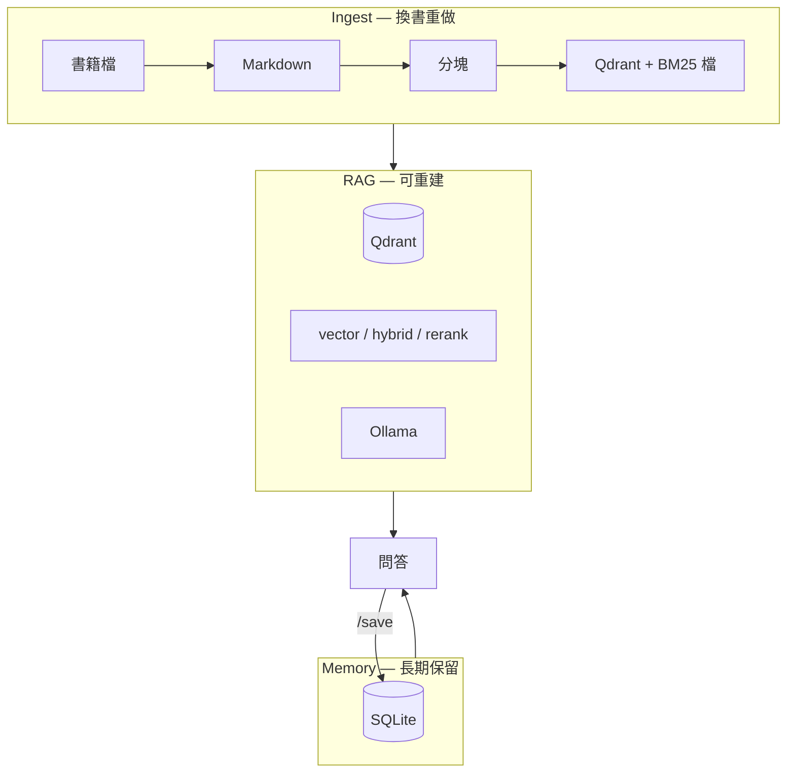

# Book Spirit — 架構

> **安裝、格式、API、`naval-almanac` 範例：** [README.md](README.md)  
> **RRF / 向量庫 / LC vs native / splitter：** [docs/LEARNING.md](docs/LEARNING.md)  
> **chat 指令：** [QUICKSTART_READING.md](QUICKSTART_READING.md)

## 定位

個人 **RAG 學習 toy**：書籍檔（PDF / EPUB / MD…）入庫 → 檢索 → Ollama 問答 → SQLite 筆記。

**主線：** `build_index.py` → `chat.py`（或 API）→ `/save`

---

## 三層



重建 Qdrant / 換 embedding **不刪** SQLite 筆記。

---

## 入庫（與 README「ETL」同義）

| 步驟 | 模組 | 說明 |
|------|------|------|
| Extract | `ingest/converter.py` | MarkItDown + 原生 `.md`（見 `ingest/formats.py`） |
| Transform | `ingest/chunker.py` | 自研分塊（中文章節、裁後記） |
| Load | `ingest/indexer.py` | BGE → `book_<id>` collection + `bm25_<id>.json` |

入口：`scripts/build_index.py`（`--all` / `--book` / `--list` / `--archive`）

---

## 問答路徑

```
問題 → [可選 Query Planner] → 檢索(top_k) → 組 prompt → Ollama → 回答+sources
                              ↑
                    vector | hybrid | hybrid_rerank
```

實作：`core/pipeline.py`（`NativeRAG`）。  
API：`api/app.py`。終端：`scripts/chat.py`。

---

## 目錄結構

```
book-spirit/
├── core/           # pipeline, hybrid, rerank, query_planner, retrieval
├── ingest/         # converter, chunker, indexer, books_registry
├── memory/         # SQLite
├── eval/           # 檢索評測邏輯
├── api/            # FastAPI
├── integrations/   # LangChain / LangGraph（可選，委派 native）
├── scripts/        # build_index, chat, eval, notes_cli
└── tests/
```

---

## 技術選型（簡表）

| 項目 | 選擇 |
|------|------|
| 書籍輸入 | PDF / EPUB / DOCX / MD…（範例：`naval-almanac.pdf`） |
| 分塊 | 自研 `chunker.py`（見 README §5 理由） |
| Embedding | BGE-small-zh + `query:` 前綴 |
| 向量庫 | Qdrant 本地，多書分 collection |
| 生成 | Ollama |
| 筆記 | SQLite |
| 可選 | BM25 hybrid、rerank、query planner |
| 評測 | `eval.py` 只評檢索，不評 LLM |

---

## 刻意不做

- 多使用者 / 權限  
- 自動發社群  
- 一次答完整本書人物傳（top-k 片段 RAG 限制）  
- 用 LangChain 重寫 ingest  

---

## 文件地圖

| 文件 | 內容 |
|------|------|
| [README.md](README.md) | 格式、API、`naval-almanac` |
| [docs/LEARNING.md](docs/LEARNING.md) | RRF、Qdrant、LC、splitter、自學 QA |
| [QUICKSTART_READING.md](QUICKSTART_READING.md) | chat 指令 |
| [etl/README.md](etl/README.md) | 入庫一鍵腳本 |
| [docs/DEPLOYMENT.md](docs/DEPLOYMENT.md) | Docker / CI |
| [OLLAMA_SETUP.md](OLLAMA_SETUP.md) | 模型 |
| `Todo.md` | 個人筆記（本機，不進 Git） |
