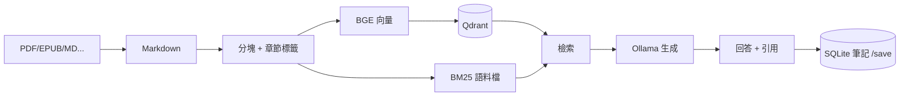

# Book Spirit

[](https://github.com/yu2C/book-spirit/actions/workflows/ci.yml)

個人用的 **RAG 學習 toy**：把書變成可搜尋的段落 → 問答（附引用）→ 把理解存進 SQLite。  
不是產品；重點是搞懂 **ingest → 檢索 → 生成** 各層在做什麼。

| 文件 | 內容 |
|------|------|
| 本檔 | 安裝、格式、API、`naval-almanac` 範例 |
| [docs/LEARNING.md](docs/LEARNING.md) | **學習筆記**：RRF、向量庫取捨、為何不用 LC 當核心、splitter QA |
| [ARCHITECTURE.md](ARCHITECTURE.md) | 三層架構、目錄 |
| [QUICKSTART_READING.md](QUICKSTART_READING.md) | `chat.py` 指令 |
| [docs/DEPLOYMENT.md](docs/DEPLOYMENT.md) | Docker / CI |

---

## 1. 支援哪些格式？

`sample_books/` 內下列副檔名會被 `build_index.py` 掃描（見 `ingest/formats.py`）：

| 類型 | 副檔名 | 處理方式 |
|------|--------|----------|
| MarkItDown（預設） | `.pdf` `.epub` `.docx` … | 轉成 `outputs/<檔名>.md` |
| MinerU（可選） | `.pdf` 等 | `.env` 設 `EXTRACT_BACKEND=mineru` + `uv sync --group mineru` |
| 原生 Markdown | `.md` `.markdown` | 複製到 `outputs/` 並做輕量清理 |

EPUB 等若轉檔失敗，可先改成 PDF 或自行準備 `.md` 放入 `sample_books/`。

**其他 PDF 勿 commit**；repo 只附範例 `sample_books/naval-almanac.pdf`（見該目錄 README 版權說明）。

---

## 2. 五分鐘跑通（內附《納瓦爾寶典》）

Clone 後已有 **`sample_books/naval-almanac.pdf`**，`book_id` 固定為 **`naval-almanac`**。

```bash
brew install uv ollama
cd book-spirit
uv sync --group langchain   # chat 預設 LangGraph 問答
ollama pull qwen2.5:7b-instruct-q4_K_M
ollama serve   # 另開終端

uv run python scripts/build_index.py --book naval-almanac
uv run python scripts/chat.py
```

可問：`什麼是專長？`、`納瓦尔推薦的閱讀方法是什麼？` → 滿意則 `/save`。

重建索引：`uv run python scripts/build_index.py --book naval-almanac --force`  
再加自己的書：丟進 `sample_books/` 後 `build_index.py --all`（會跳過未變更的書）。

---

## 3. 整條 pipeline 在做什麼？



與 [ARCHITECTURE.md](ARCHITECTURE.md) 的 **Ingest / RAG / Memory** 三層一致；差別在：本檔講「怎麼用、名詞是什麼」，ARCHITECTURE 講「模組放哪、取捨」。

---

## 4. 名詞解釋（讀 README 會看到的詞）

### RAG（Retrieval-Augmented Generation）

先**從書裡搜出相關段落**，再交給 LLM 根據這些段落回答，降低瞎編。本專案核心在 `core/pipeline.py` 的 `NativeRAG`。

### ETL（本專案裡指「入庫」三步）

| 字母 | 意思 | 本 repo |
|------|------|---------|
| **E** Extract | 取出原文 | 書籍檔 → Markdown（`ingest/converter.py`） |
| **T** Transform | 整理成可搜尋單位 | 分塊 + `chapter` / `heading`（`ingest/chunker.py`） |
| **L** Load | 寫進儲存 | 向量進 Qdrant、BM25 寫 `qdrant_storage/bm25_<book_id>.json`（`ingest/indexer.py`） |

一鍵等同 `scripts/build_index.py`；`bash etl/run_pipeline.sh` 還會順跑檢索預覽評測。

### Embedding / 向量（vector）

把一段文字變成**固定長度的數字向量**（本專案用 `BAAI/bge-small-zh-v1.5`）。  
**語意相近的段落，向量距離較近。** 問句也會 embed 一次，再到 Qdrant 找最相近的 chunk。

查詢時會加前綴 `query:`（BGE 建議用法，見 `core/config.py`）。

### 向量檢索（`retrieval_strategy: vector`）

只靠 embedding 相似度排序，適合**換句話說的語意搜尋**。

### BM25

傳統**關鍵字**匹配（詞頻）。專長、槓桿、具體人名等**字面對得上**時 often 更穩。  
語料在 `qdrant_storage/bm25_<book_id>.json`，建索引時產生。

### Hybrid（`retrieval_strategy: hybrid`）

**向量 + BM25 各搜一輪**，用 **RRF** 合併排名（公式與直覺見 [docs/LEARNING.md §3](docs/LEARNING.md#3-rrf-是什麼你寫的-rpf-多半指這個)）。  
環境變數也可設 `RETRIEVAL_MODE=hybrid`。

### Rerank（`hybrid_rerank`，**預設**）

Hybrid 先抓約 15 條候選，再用 **cross-encoder**（`bge-reranker-base`）對「問題–段落」精排，最後只留 `top_k` 條。更準、較慢；低分時 fallback 會先加寬 top_k，再降級 hybrid → vector。

### top_k

最後送進 LLM 的**段落數**（預設 5）。越大上下文越多、越慢，也越容易塞進無關片段。

### Qdrant

本地向量資料庫，資料在 `./qdrant_storage/`。多書時每本一個 collection：`book_<book_id>`。

### Memory（SQLite）

`data/reading_memory.db` 存**你自己的筆記與 profile**，與向量索引分開；換 embedding 重建索引不影響筆記。

### Backend：`native` / `langchain` / `langgraph`

| 值 | 說明 |
|----|------|
| `native` | 預設，全部走 `core.pipeline` |
| `langchain` / `langgraph` | 薄包裝，方便對照；需 `uv sync --group langchain` |

### Query Planner（可選）

`.env` 設 `USE_QUERY_PLANNER=true` 時，先用 Ollama 把問題改寫成 1～3 條**檢索用**英文/中文短句（不直接回答）。見 `core/query_planner.py`。

---

## 5. 分塊、LangChain、向量庫（深入）

這幾題寫在 **[docs/LEARNING.md](docs/LEARNING.md)**，避免 README 過長：

- §4 為何選 **Qdrant**、和其他向量庫比較  
- §5 為何不直接用 **LangChain / LangGraph**  
- §6 為何自研 **chunker**、現成 splitter 差在哪  
- §8 常見 **QA**

預設分塊：**語意切**（`CHUNKER_MODE=semantic`，`SEMANTIC_MIN_CHUNK_SIZE=128`）；上限 `chunk_size=512`、`overlap=64`。長篇章節書可改 `CHUNKER_MODE=native` 後 `--force` 重建（見 [LEARNING.md §6](docs/LEARNING.md)）。

---

## 6. 怎麼測 API？

### 6.1 啟動

```bash
ollama serve
uv run python -m api
```

瀏覽器開：**http://127.0.0.1:8000/docs**（Swagger，可點「Try it out」）。

### 6.2 健康檢查

```bash
curl http://127.0.0.1:8000/health
```

### 6.3 純檢索（不呼叫 LLM，最快驗證索引）

```bash
curl -s -X POST http://127.0.0.1:8000/search \
  -H "Content-Type: application/json" \
  -d '{
    "question": "什麼是專長？",
    "retrieval_strategy": "hybrid_rerank",
    "top_k": 3
  }' | python -m json.tool
```

看回傳 `sources[].text_preview` 是否像書裡關於「專長」的段落。

### 6.4 Hybrid 檢索

```bash
curl -s -X POST http://127.0.0.1:8000/search \
  -H "Content-Type: application/json" \
  -d '{
    "question": "納瓦尔推薦的閱讀方法",
    "retrieval_strategy": "hybrid",
    "top_k": 5
  }' | python -m json.tool
```

需已跑過 `build_index.py`（會產生對應書的 `bm25_<book_id>.json`）。

### 6.5 RAG 問答（需要 Ollama）

```bash
curl -s -X POST http://127.0.0.1:8000/ask \
  -H "Content-Type: application/json" \
  -d '{
    "question": "如何不靠運氣致富？",
    "backend": "native",
    "top_k": 5,
    "temperature": 0.7
  }' | python -m json.tool
```

回傳含 `answer` 與 `sources`（引用段落）。

### 6.6 多書時指定 book_id

先 `build_index.py --list` 查 id，再：

```bash
curl -s -X POST http://127.0.0.1:8000/ask \
  -H "Content-Type: application/json" \
  -d '{
    "question": "什麼是槓桿？",
    "book_id": "naval-almanac",
    "top_k": 5
  }' | python -m json.tool
```

### 6.7 依章節過濾（metadata，可選）

標題來自 PDF 解析，可能不完整：

```bash
curl -s -X POST http://127.0.0.1:8000/search \
  -H "Content-Type: application/json" \
  -d '{
    "question": "專長",
    "chapter": "第一部分",
    "top_k": 3
  }' | python -m json.tool
```

---

## 7. 檢索評測（`scripts/eval.py`）

**只測「搜到的段落對不對」，不測 LLM 會不會瞎掰。**

```bash
uv run python scripts/eval.py --preview
```

內建題目偏《納瓦爾寶典》主題；會印每題 top-k 相似度，供你人工看相關性。  
報告可寫入本機 `search_quality_report.json`（已在 `.gitignore`）。

---

## 8. 安裝選項

```bash
uv sync                              # 核心：ingest + RAG + API + pytest
uv sync --group langchain            # 外加 LangChain / LangGraph 對照
```

依賴以 `pyproject.toml` + `uv.lock` 為準；勿對系統 Python 直接 `pip install`。

環境變數：複製 `.env.example` → `.env`（Ollama、`RETRIEVAL_MODE`、`USE_QUERY_PLANNER` 等）。

---

## 9. 目錄與模組

與 [ARCHITECTURE.md#目錄結構](ARCHITECTURE.md#目錄結構) 相同：

| 路徑 | 職責 |
|------|------|
| `ingest/` | PDF→MD、分塊、建索引 |
| `core/` | 檢索、hybrid、rerank、pipeline |
| `memory/` | SQLite 筆記 |
| `api/` | FastAPI |
| `scripts/build_index.py` | 入庫入口 |
| `scripts/chat.py` | 終端問答 |
| `scripts/eval.py` | 檢索評測 |
| `integrations/` | LangChain / LangGraph（可選） |

---

## 10. 常見問題

**Q: 支援哪些格式？**  
A: 見上文 §1；清單在 `ingest/formats.py`。

**Q: LangChain backend 失敗？**  
A: `uv sync --group langchain`。

**Q: 搜尋結果差？**  
A: `eval.py --preview` → 調 `chunk_size` / `overlap` → `build_index.py --book <id> --force`。

**Q: Ollama 連不上？**  
A: 另開終端 `ollama serve`；模型見 [OLLAMA_SETUP.md](OLLAMA_SETUP.md)。

**Q: 資料存在哪？**  
A: 向量 `qdrant_storage/`、筆記 `data/reading_memory.db`、轉檔 `outputs/`（皆不應提交 Git）。

---

## 11. 還可玩什麼

- `chat.py`：`/books`、`/book <id>`、`/save`（見 [QUICKSTART_READING.md](QUICKSTART_READING.md)）
- `.env`：`USE_QUERY_PLANNER=true`、`RETRIEVAL_MODE=hybrid`
- 部署：[docs/DEPLOYMENT.md](docs/DEPLOYMENT.md)

個人實作筆記在本機 `Todo.md`（不進 Git）。
