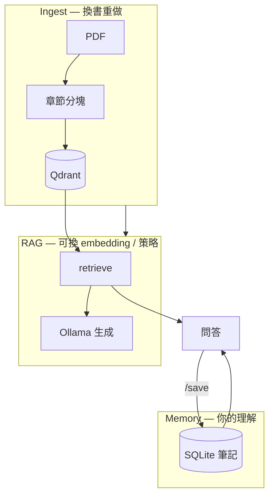

# 📚 Book Spirit

[](https://github.com/yu2C/book-spirit/actions/workflows/ci.yml)

**Swappable local RAG + personal reading memory** — ingest a book, ask with citations, save what you understood; retrieval stack can be rebuilt without losing your notes.

| 你是… | 從這裡讀 |
|--------|----------|
| **面試官 / 第一次看 repo** | 下方「求職摘要」→ [ARCHITECTURE.md](ARCHITECTURE.md) |
| **自己要讀書、記心得** | [QUICKSTART_READING.md](QUICKSTART_READING.md) |
| **部署 / CI** | [docs/DEPLOYMENT.md](docs/DEPLOYMENT.md) |

---

## 求職摘要（B）

**EN:** Personal reading memory (SQLite) on a swappable RAG stack: MarkItDown → chapter-aware chunking → BGE + Qdrant → Ollama, with retrieval-only eval and optional hybrid/rerank experiments. LangChain/LangGraph are thin wrappers over native—not the core.

**中文：** 在可替換的 RAG 底座上，用 **SQLite 沉澱讀者自己的理解**；檢索與生成分離、固定題集評測檢索層。核心為自研 `native` pipeline；LangChain / LangGraph 僅作對照與履歷關鍵字。

| 關鍵字 | 對應 |
|--------|------|
| RAG / Vector DB | ingest → BGE → Qdrant → `/ask` |
| Personal memory | `memory/store.py` — 筆記與 profile，與向量索引分離 |
| Eval | `scripts/eval.py` — precision@k，不混 LLM 錯誤 |
| Hybrid / Rerank | 進階實驗，見 ARCHITECTURE |
| LangChain / LangGraph | 可選，委派 native |
| FastAPI / CI | API + pytest；部署見 docs/DEPLOYMENT |

**面試開場（30 秒）：** 見 [ARCHITECTURE.md#面試怎麼講](ARCHITECTURE.md#面試怎麼講b30-秒--追問)。

---

## 架構一覽



> 完整模組表、取捨、不做清單：[ARCHITECTURE.md](ARCHITECTURE.md)

### 檢索策略（進階，可選）

| `retrieval_strategy` | 行為 |
|----------------------|------|
| `vector`（預設） | 純向量 |
| `hybrid` | BM25 + 向量 RRF |
| `hybrid_rerank` | hybrid → cross-encoder |

### Backend（可選對照）

| Backend | 說明 |
|---------|------|
| `native` | **預設**，實際幹活 |
| `langchain` / `langgraph` | 薄層；`uv sync --group langchain` |

---

## 快速開始（工程）

### 1. 安裝依賴（[uv](https://docs.astral.sh/uv/)）

```bash
# 安裝 uv（若尚未安裝）
brew install uv

# 核心 pipeline（步驟 1–4，native 檢索）
uv sync

# 完整 API（含 LangChain + LangGraph）
uv sync --group langchain
```

> 請勿對系統 Python 直接 `pip install`（macOS Homebrew 會阻擋）。  
> 舊版 `requirements*.txt` 仍保留對照；日常以 `pyproject.toml` + `uv.lock` 為準。

日常讀書 → **[QUICKSTART_READING.md](QUICKSTART_READING.md)**（`scripts/build_index.py` → `scripts/chat.py`）

### 2. 準備書籍

將 PDF 放入 `sample_books/`。

### 3. 建索引 + 問答

```bash
ollama serve   # 另一終端
uv run python scripts/build_index.py
uv run python scripts/chat.py          # 問答；答完 /save 存筆記
```

### 4. 評測 / API（可選）

```bash
uv run python scripts/eval.py --preview
uv run python -m api                   # http://127.0.0.1:8000/docs
```

```bash
# native（預設）
curl -X POST "http://127.0.0.1:8000/ask" \
  -H "Content-Type: application/json" \
  -d '{"question": "如何找到自己的專長？", "backend": "native"}'

# LangChain retriever
curl -X POST "http://127.0.0.1:8000/ask" \
  -H "Content-Type: application/json" \
  -d '{"question": "如何不靠運氣致富？", "backend": "langchain"}'

# LangGraph workflow
curl -X POST "http://127.0.0.1:8000/ask" \
  -H "Content-Type: application/json" \
  -d '{"question": "幸福是一種可以學習的技能嗎？", "backend": "langgraph"}'
```

環境變數 `RAG_BACKEND=langchain` 可改預設 backend。複製 `.env.example` → `.env` 可設定 `DATABASE_URL`、`QDRANT_URL`。

---

## ETL 入庫流程

詳見 [`etl/README.md`](etl/README.md)。

| 階段 | 腳本 | 說明 |
|------|------|------|
| Extract | `ingest/converter.py` | PDF → Markdown |
| Transform | `ingest/chunker.py` | 分塊 + 章節 metadata |
| Load | `ingest/indexer.py` | BGE embedding → Qdrant |

```bash
bash etl/run_pipeline.sh
```

---

## REST API

| 方法 | 路徑 | 說明 |
|------|------|------|
| GET | `/health` | Ollama / Qdrant / Postgres 連線狀態 |
| POST | `/search` | 純向量檢索（不需 Ollama） |
| POST | `/ask` | RAG 問答（需 Ollama） |
| GET | `/docs` | Swagger UI（可在此試 API） |

`/search` 範例：

```bash
curl -X POST "http://127.0.0.1:8000/search" \
  -H "Content-Type: application/json" \
  -d '{"question": "如何找到自己的專長？", "backend": "native", "top_k": 3}'
```

**Metadata filter**（可選，子字串比對；`/ask` 同樣支援）：

```bash
curl -X POST "http://127.0.0.1:8000/search" \
  -H "Content-Type: application/json" \
  -d '{
    "question": "什麼是專長？",
    "chapter": "第一部分",
    "heading": "專長",
    "top_k": 3
  }'
```

回應會多帶 `filters` 欄位，方便確認本次套用的條件。

限制：

- `chapter` / `heading` / `book_title` 來自 PDF 解析，標題可能不完整或與書中略有出入
- 需先執行 `uv run python scripts/build_index.py` 建立 payload TEXT index 與 `bm25_corpus.json`；舊索引請重建
- 即使 Qdrant 端 filter 未命中，仍會在 Python 再做一次子字串 post-filter

**Hybrid 檢索**（BM25 + 向量，RRF 合併）：

```bash
curl -X POST "http://127.0.0.1:8000/search" \
  -H "Content-Type: application/json" \
  -d '{"question": "如何找到自己的專長？", "retrieval_strategy": "hybrid", "top_k": 3}'
```

或 `retrieval_mode: hybrid` / 環境變數 `RETRIEVAL_MODE=hybrid`。hybrid 需 `qdrant_storage/bm25_corpus.json`（建索引時自動產生）。

**Reranker**（Cross-encoder 重排，建議用 `hybrid_rerank` 一次指定）：

```bash
curl -X POST "http://127.0.0.1:8000/search" \
  -H "Content-Type: application/json" \
  -d '{
    "question": "如何找到自己的專長？",
    "retrieval_strategy": "hybrid_rerank",
    "top_k": 3
  }'
```

- 流程：hybrid 取候選 M=15（`RERANK_CANDIDATES`）→ `BAAI/bge-reranker-base` 重排 → top_k
- 回應 `sources` 含 `score`（rerank 分數）、`retrieval_score`（RRF/向量分數）、`score_source`
- WSL/CPU 典型延遲約 +100–300ms；預設關閉，可設 `USE_RERANK=true` 或請求帶 `use_rerank: true`

> Swagger 截圖：啟動 API 後開啟 http://127.0.0.1:8000/docs 即可互動測試。

---

## 部署與 CI

見 [docs/DEPLOYMENT.md](docs/DEPLOYMENT.md)。

## 檢索評測（`scripts/eval.py`）

**量什麼：**

- 對固定測試題（《納瓦爾寶典》主題）做 top-k 向量搜尋
- 輸出每題的 **相似度分數**（BGE + `query:` 前綴）
- **人工評分**（1–5）：前 3 筆結果是否與問題相關
- 彙整 **precision@k** 與 `search_quality_report.json`

**怎樣算好：**

- 相似度 > **0.7** 通常表示高度相關（依書籍與分塊而異）
- precision@3 ≥ **0.7** 代表多數題目的 top-3 有可用段落
- bad case：分數高但內容偏題 → 調 chunk size / overlap 或 heading 解析

**不做的事：** 此腳本**不含 LLM 生成**，只評估檢索層，避免把生成錯誤誤判為檢索問題。

---

## 檔案結構

見 [ARCHITECTURE.md#目錄結構](ARCHITECTURE.md#目錄結構)。

---

## 技術決策

| 選項 | 原因 |
|------|------|
| MarkItDown | 微軟維護、中文 PDF 轉 MD 夠用 |
| 自研分塊 | 可精準處理無 `#` 標題的中文書籍結構 |
| BGE-small-zh | 中文輕量、M4/WSL 可跑；查詢需 `query:` 前綴 |
| Qdrant 本地 | Vector DB 展示、metadata 過濾、延遲低 |
| Ollama | 本地 LLM、隱私優先 |
| LangChain 薄層 | 履歷關鍵字 + 與 native 結果可對照 |
| LangGraph | 多步 workflow 敘事（retrieve → generate） |

---

## 硬體要求

| 配件 | 需求 |
|------|------|
| CPU | 任何現代 x64 / ARM |
| 記憶體 | 8GB+（16GB 較舒適，含 Ollama 7B） |
| 磁碟 | ~15GB（模型 + Qdrant + PyTorch） |

---

## 常見問題

**Q: LangChain backend 啟動失敗？**  
A: 執行 `uv sync --group langchain`。

**Q: 搜尋結果差？**  
A: 先跑 `uv run python scripts/eval.py --preview`，調 chunk size（預設 512）或 overlap（64），再重建索引。

**Q: Ollama 連不上？**  
A: 另開終端執行 `ollama serve`，並確認已 pull `qwen2.5:7b-instruct-q4_K_M`。

**Q: Qdrant 資料在哪？**  
A: `./qdrant_storage/`（持久化，刪除後需重跑步驟 3）。

---

## 下一步

| 優先 | 內容 |
|------|------|
| 個人 | 問答 + `/save` 累積筆記；eval 題庫自訂 |
| 內容（C） | 從筆記生成讀書片段草稿（規劃中） |
| 面試（B） | 依 ARCHITECTURE 練講；必要時補 eval 數字 |
| 可選 | 上雲 Phase 4、目錄重構 |

見 [Todo.md](Todo.md)。
