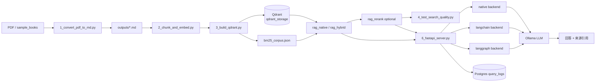

# 📚 Book Spirit — 書籍 RAG 知識助手

[](https://github.com/yu2C/book-spirit/actions/workflows/ci.yml)

本地部署的中文 RAG 系統：PDF 入庫 → 向量檢索 → Ollama 生成回答，附章節引用。  
支援 **native**、**LangChain retriever**、**LangGraph workflow** 三種 backend 切換。

---

## 求職向摘要

**EN:** End-to-end RAG pipeline (MarkItDown → chunk → BGE → Qdrant → FastAPI → Ollama) with retrieval evaluation, optional LangChain retriever, and LangGraph retrieve→generate workflow.

**中文：** 自研 ingest + 向量檢索 pipeline，整合 Qdrant Vector DB、FastAPI REST API、Ollama 本地 LLM；提供搜尋品質評測腳本，並以 LangChain / LangGraph 薄層展示框架整合能力。

| 關鍵字 | 本專案對應 |
|--------|------------|
| RAG | PDF→MD→chunk→embed→retrieve→generate |
| Vector DB | Qdrant（本地持久化 `./qdrant_storage`） |
| Embedding | BAAI/bge-small-zh-v1.5（查詢加 `query:` 前綴） |
| FastAPI | `6_fastapi_server.py` — `/health`, `/search`, `/ask`, `/docs` |
| PostgreSQL | `query_log.py` — 每次 query / top-k chunk id / latency |
| CI/CD | GitHub Actions + pytest + ruff |
| LangChain | `langchain_retriever.py` — Qdrant + BGE retriever |
| LangGraph | `rag_graph.py` — retrieve → generate 流程 |
| Hybrid Search | `rag_hybrid.py` — BM25 + 向量 RRF 融合 |
| Reranker | `rag_rerank.py` — BGE cross-encoder 重排 |
| Metadata Filtering | Qdrant payload filter + post-filter |
| Eval | `4_test_search_quality.py` — 人工評分 + 相似度報告 |

---

## 系統架構



### 檢索策略（三檔）

| `retrieval_strategy` | 行為 | 典型用途 |
|----------------------|------|----------|
| `vector`（預設） | 純向量 top_k | 最快、baseline |
| `hybrid` | BM25 + 向量 RRF → top_k | 關鍵字 + 語意 |
| `hybrid_rerank` | hybrid 取 M=15 → cross-encoder → top_k | 最高 precision |

環境變數 `RETRIEVAL_STRATEGY=hybrid_rerank` 可設全域預設；仍可用 `retrieval_mode` + `use_rerank` 分開指定（向下相容）。

### Backend 對照

| Backend | 檢索 | 生成 | 用途 |
|---------|------|------|------|
| `native` | SentenceTransformer + qdrant-client | Ollama HTTP | 預設、依賴最輕 |
| `langchain` | LangChain Qdrant + HuggingFaceEmbeddings | 共用 Ollama | 展示 LangChain retriever |
| `langgraph` | LangChain retriever | LangGraph retrieve→generate | 展示 workflow / agent 敘事 |

> **LlamaIndex：** 未整合；架構上可替換 LangChain retriever 層，README 保留擴充空間。

---

## 快速開始

### 1. 安裝依賴

```bash
# 核心 pipeline（步驟 1–4，native 檢索）
pip install -r requirements.txt

# 完整 API（含 LangChain + LangGraph）
pip install -r requirements-langchain.txt
```

### 2. 準備書籍

將 PDF 放入 `sample_books/`（目前測試書：《納瓦爾寶典》）。

### 3. 建立索引（步驟 1–3）

```bash
python 1_convert_pdf_to_md.py
python 2_chunk_and_embed.py      # 分塊實驗（可選，步驟 3 會共用分塊邏輯）
python 3_build_qdrant.py         # Embedding + 寫入 Qdrant
```

### 4. 評測搜尋品質（步驟 4）

```bash
python 4_test_search_quality.py --preview   # 只看搜尋結果
python 4_test_search_quality.py             # 互動評分（預設 6 題）
python 4_test_search_quality.py --all       # 全部題目
```

### 5. LLM 問答（步驟 5，CLI）

```bash
ollama pull qwen2.5:7b-instruct-q4_K_M
ollama serve   # 另一終端

python 5_generate_answer_with_llm.py
python 5_generate_answer_with_llm.py --demo
```

### 6. 啟動 API（步驟 6）

```bash
python 6_fastapi_server.py
# http://127.0.0.1:8000/docs
```

```bash
# native（預設）
curl -X POST "http://127.0.0.1:8000/ask" \
  -H "Content-Type: application/json" \
  -d '{"question": "如何找到自己的專長？", "backend": "native"}'

# LangChain retriever
curl -X POST "http://127.0.0.1:8000/ask" \
  -H "Content-Type: application/json" \
  -d '{"question": "如何不靠運氣致富？", "backend": "langchain"}'

# LangGraph workflow
curl -X POST "http://127.0.0.1:8000/ask" \
  -H "Content-Type: application/json" \
  -d '{"question": "幸福是一種可以學習的技能嗎？", "backend": "langgraph"}'
```

環境變數 `RAG_BACKEND=langchain` 可改預設 backend。複製 `.env.example` → `.env` 可設定 `DATABASE_URL`、`QDRANT_URL`。

---

## ETL 入庫流程

詳見 [`etl/README.md`](etl/README.md)。

| 階段 | 腳本 | 說明 |
|------|------|------|
| Extract | `1_convert_pdf_to_md.py` | PDF → Markdown |
| Transform | `2_chunk_and_embed.py` | 分塊 + 章節 metadata |
| Load | `3_build_qdrant.py` | BGE embedding → Qdrant |

```bash
bash etl/run_pipeline.sh
```

---

## REST API

| 方法 | 路徑 | 說明 |
|------|------|------|
| GET | `/health` | Ollama / Qdrant / Postgres 連線狀態 |
| POST | `/search` | 純向量檢索（不需 Ollama） |
| POST | `/ask` | RAG 問答（需 Ollama） |
| GET | `/docs` | Swagger UI（可在此試 API） |

`/search` 範例：

```bash
curl -X POST "http://127.0.0.1:8000/search" \
  -H "Content-Type: application/json" \
  -d '{"question": "如何找到自己的專長？", "backend": "native", "top_k": 3}'
```

**Metadata filter**（可選，子字串比對；`/ask` 同樣支援）：

```bash
curl -X POST "http://127.0.0.1:8000/search" \
  -H "Content-Type: application/json" \
  -d '{
    "question": "什麼是專長？",
    "chapter": "第一部分",
    "heading": "專長",
    "top_k": 3
  }'
```

回應會多帶 `filters` 欄位，方便確認本次套用的條件。

限制：

- `chapter` / `heading` / `book_title` 來自 PDF 解析，標題可能不完整或與書中略有出入
- 需先執行 `python 3_build_qdrant.py` 建立 payload TEXT index 與 `bm25_corpus.json`；舊索引請重建
- 即使 Qdrant 端 filter 未命中，仍會在 Python 再做一次子字串 post-filter

**Hybrid 檢索**（BM25 + 向量，RRF 合併）：

```bash
curl -X POST "http://127.0.0.1:8000/search" \
  -H "Content-Type: application/json" \
  -d '{"question": "如何找到自己的專長？", "retrieval_strategy": "hybrid", "top_k": 3}'
```

或 `retrieval_mode: hybrid` / 環境變數 `RETRIEVAL_MODE=hybrid`。hybrid 需 `qdrant_storage/bm25_corpus.json`（建索引時自動產生）。

**Reranker**（Cross-encoder 重排，建議用 `hybrid_rerank` 一次指定）：

```bash
curl -X POST "http://127.0.0.1:8000/search" \
  -H "Content-Type: application/json" \
  -d '{
    "question": "如何找到自己的專長？",
    "retrieval_strategy": "hybrid_rerank",
    "top_k": 3
  }'
```

- 流程：hybrid 取候選 M=15（`RERANK_CANDIDATES`）→ `BAAI/bge-reranker-base` 重排 → top_k
- 回應 `sources` 含 `score`（rerank 分數）、`retrieval_score`（RRF/向量分數）、`score_source`
- WSL/CPU 典型延遲約 +100–300ms；預設關閉，可設 `USE_RERANK=true` 或請求帶 `use_rerank: true`

> Swagger 截圖：啟動 API 後開啟 http://127.0.0.1:8000/docs 即可互動測試。

---

## Docker Compose

```bash
cp .env.example .env
# 可選：先把索引載入 Qdrant 容器
QDRANT_URL=http://localhost:6333 python 3_build_qdrant.py

docker compose up -d
curl http://localhost:8000/health
```

服務：`qdrant`（6333）+ `postgres`（5432）+ `api`（8000）。  
設定 `DATABASE_URL` 後，每次 `/search` 與 `/ask` 會非同步寫入 `query_logs` 表。

---

## 測試與 CI

```bash
pip install -r requirements-test.txt
RAG_SKIP_INIT=1 pytest -q
ruff check rag_*.py query_log.py langchain_retriever.py 6_fastapi_server.py tests/
```

可選 pre-commit：

```bash
pip install pre-commit && pre-commit install
```

## 檢索評測（`4_test_search_quality.py`）

**量什麼：**

- 對固定測試題（《納瓦爾寶典》主題）做 top-k 向量搜尋
- 輸出每題的 **相似度分數**（BGE + `query:` 前綴）
- **人工評分**（1–5）：前 3 筆結果是否與問題相關
- 彙整 **precision@k** 與 `search_quality_report.json`

**怎樣算好：**

- 相似度 > **0.7** 通常表示高度相關（依書籍與分塊而異）
- precision@3 ≥ **0.7** 代表多數題目的 top-3 有可用段落
- bad case：分數高但內容偏題 → 調 chunk size / overlap 或 heading 解析

**不做的事：** 此腳本**不含 LLM 生成**，只評估檢索層，避免把生成錯誤誤判為檢索問題。

---

## 檔案結構

```
.
├── 1_convert_pdf_to_md.py
├── 2_chunk_and_embed.py         # 自研分塊（regex + overlap）
├── 3_build_qdrant.py            # BGE embed + Qdrant 持久化
├── 4_test_search_quality.py     # 檢索品質評測
├── 5_generate_answer_with_llm.py  # CLI 問答
├── 6_fastapi_server.py          # REST API（三 backend）
├── rag_config.py                # 共用設定
├── rag_native.py                # native pipeline
├── langchain_retriever.py       # LangChain retriever 薄層
├── rag_graph.py                 # LangGraph retrieve→generate
├── requirements.txt             # 核心依賴
├── requirements-langchain.txt   # + LangChain / LangGraph
├── query_log.py                 # Postgres query log
├── docker-compose.yml
├── Dockerfile
├── docker/init.sql
├── etl/README.md                # ETL 流程說明
├── requirements-test.txt        # 輕量 CI 測試依賴
├── tests/                       # pytest 煙霧測試
├── .github/workflows/ci.yml
├── sample_books/
├── outputs/
└── qdrant_storage/              # 向量索引（gitignore）
```

---

## 技術決策

| 選項 | 原因 |
|------|------|
| MarkItDown | 微軟維護、中文 PDF 轉 MD 夠用 |
| 自研分塊 | 可精準處理無 `#` 標題的中文書籍結構 |
| BGE-small-zh | 中文輕量、M4/WSL 可跑；查詢需 `query:` 前綴 |
| Qdrant 本地 | Vector DB 展示、metadata 過濾、延遲低 |
| Ollama | 本地 LLM、隱私優先 |
| LangChain 薄層 | 履歷關鍵字 + 與 native 結果可對照 |
| LangGraph | 多步 workflow 敘事（retrieve → generate） |

---

## 硬體要求

| 配件 | 需求 |
|------|------|
| CPU | 任何現代 x64 / ARM |
| 記憶體 | 8GB+（16GB 較舒適，含 Ollama 7B） |
| 磁碟 | ~15GB（模型 + Qdrant + PyTorch） |

---

## 常見問題

**Q: LangChain backend 啟動失敗？**  
A: 執行 `pip install -r requirements-langchain.txt`。

**Q: 搜尋結果差？**  
A: 先跑 `4_test_search_quality.py --preview`，調 chunk size（預設 512）或 overlap（64），再重建索引。

**Q: Ollama 連不上？**  
A: 另開終端執行 `ollama serve`，並確認已 pull `qwen2.5:7b-instruct-q4_K_M`。

**Q: Qdrant 資料在哪？**  
A: `./qdrant_storage/`（持久化，刪除後需重跑步驟 3）。

---

## 下一步（見 `book-spirit-Todo.md`）

- Phase 4：Cloud 部署（Railway / Render 等）
- Phase 5：Prompt 版本化、回答品質 eval
- Phase 6：履歷 / 104 同步
