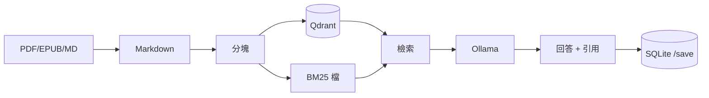

# Book Spirit

[](https://github.com/yu2C/book-spirit/actions/workflows/ci.yml)

Side project：**用一本書練 RAG**——入庫、檢索、帶引用問答、把心得存 SQLite。  
不是產品；目的是搞懂各層怎麼接（面試時可當 toy case 講）。

| 文件 | 內容 |
|------|------|
| 本檔 | 安裝、名詞、API |
| [ARCHITECTURE.md](ARCHITECTURE.md) | 模組與資料流 |
| [docs/LEARNING.md](docs/LEARNING.md) | 技術取捨（Qdrant、hybrid、chunker） |
| [QUICKSTART_READING.md](QUICKSTART_READING.md) | `chat.py` 指令 |
| [docs/DEPLOYMENT.md](docs/DEPLOYMENT.md) | Docker / CI（可選） |

---

## 快速開始

Repo 內附 `sample_books/naval-almanac.pdf`，`book_id` 為 **`naval-almanac`**。

```bash
brew install uv ollama
cd book-spirit
uv sync --group langchain
ollama pull qwen2.5:7b-instruct-q4_K_M
ollama serve   # 另開終端

uv run python scripts/build_index.py --book naval-almanac
uv run python scripts/chat.py
```

支援格式見 `ingest/formats.py`（PDF、EPUB、DOCX、MD 等）。其他 PDF 勿 commit。

---

## Pipeline 概覽



**Ingest：** `ingest/converter.py` → `chunker.py` → `indexer.py`（入口 `scripts/build_index.py`）  
**RAG：** `core/pipeline.py`（`NativeRAG`），預設 `hybrid_rerank` + fallback 梯子  
**問答：** `chat.py` / API 預設 `langgraph` backend（圖結構在 `integrations/langgraph.py`，節點共用 `core/ask_orchestrator.py`）  
**筆記：** `memory/store.py`，與向量索引分開

細節見 [ARCHITECTURE.md](ARCHITECTURE.md)。

---

## 名詞（簡表）

| 詞 | 意思 |
|----|------|
| **RAG** | 先搜書內段落，再交 LLM 生成 |
| **Embedding** | BGE-small-zh；查詢加 `query:` 前綴 |
| **vector / hybrid / hybrid_rerank** | 純向量 → 向量+BM25(RRF) → 再加 cross-encoder 精排（預設） |
| **top_k** | 送進 LLM 的段落數（預設 5） |
| **Qdrant** | 本地向量庫，`qdrant_storage/`，多書分 collection |
| **Memory** | SQLite 筆記，重建索引不會刪 |

RRF、為何選 Qdrant、chunker 對照 → [docs/LEARNING.md](docs/LEARNING.md)

---

## API

```bash
ollama serve
uv run python -m api
# http://127.0.0.1:8000/docs
```

純檢索（不呼叫 LLM）：

```bash
curl -s -X POST http://127.0.0.1:8000/search \
  -H "Content-Type: application/json" \
  -d '{"question": "什麼是專長？", "top_k": 3}' | python -m json.tool
```

問答：

```bash
curl -s -X POST http://127.0.0.1:8000/ask \
  -H "Content-Type: application/json" \
  -d '{"question": "如何不靠運氣致富？", "book_id": "naval-almanac"}' | python -m json.tool
```

`book_id`、`chapter`、`retrieval_strategy` 等見 Swagger。

---

## 評測

```bash
uv run python scripts/eval.py --preview          # 人工看 top-k
uv run python scripts/eval.py --golden           # 金標 eval/test_cases.json
```

只評**檢索**，不評 LLM 會不會瞎編。

一鍵入庫 + 預覽：`bash etl/run_pipeline.sh`

---

## 目錄

| 路徑 | 職責 |
|------|------|
| `ingest/` | 轉檔、分塊、建索引 |
| `core/` | 檢索、pipeline、ask 編排 |
| `memory/` | SQLite 筆記 |
| `api/` | FastAPI |
| `integrations/` | LangChain / LangGraph（薄包裝，對照用） |
| `scripts/` | `build_index`、`chat`、`eval` |

---

## 常見問題

**Ollama 連不上？** 另開終端 `ollama serve`；模型預設 `qwen2.5:7b-instruct-q4_K_M`（`.env` 可改 `OLLAMA_MODEL`）。

**檢索結果差？** `eval.py --golden` 或 `--preview` → 調 chunk / `RETRIEVAL_STRATEGY` → `build_index.py --book <id> --force`。

**LangChain 相關 import 失敗？** `uv sync --group langchain`。

**資料在哪？** `qdrant_storage/`、`data/reading_memory.db`、`outputs/`（皆不提交 Git）。
