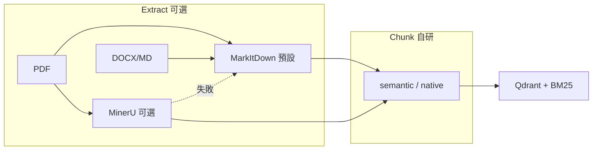

# Book Spirit — 學習筆記

> 給**自己複習 RAG**用：名詞、取捨、常見 QA。  
> 操作步驟見 [README.md](../README.md)；模組結構見 [ARCHITECTURE.md](../ARCHITECTURE.md)。

---

## 2. 名詞速查

| 詞 | 一句話 |
|----|--------|
| **RAG** | 先搜書再生成，答案要掛在段落上 |
| **Chunk** | 切成可檢索的小段（本專案預設 512 字 + overlap 64） |
| **Embedding** | 文字 → 向量；本專案 BGE-small-zh，查詢加 `query:` |
| **Vector 檢索** | 比「意思像不像」，不一定要有相同字 |
| **BM25** | 比「關鍵字像不像」，專名、術語 often 更穩 |
| **RRF** | 把多份排名列表合併成分數（見 §3） |
| **Hybrid** | 向量 + BM25，再用 RRF 合併 |
| **Rerank** | 對候選段落用 cross-encoder 精排（更慢更準） |
| **top_k** | 最後餵給 LLM 的段落數 |
| **Qdrant** | 本專案用的向量資料庫（見 §4） |
| **Memory** | SQLite 裡**你的筆記**，不是書的全文 |

---

## 3. RRF 是什麼？（你寫的 RPF 多半指這個）

**RRF = Reciprocal Rank Fusion（倒數排名融合）**

情境：hybrid 檢索時，**向量**有一份排名，**BM25** 有另一份排名，怎麼合成？

對每個段落 \(d\)，在每份列表裡若排在第 \(r\) 名（從 0 起算），就加：

\[
\text{score}(d) += \frac{1}{k + r + 1}
\]

本專案 `k = 60`（`core/hybrid.py` 的 `RRF_K`）。  
**直覺：** 在任一份列表裡排越前面，加越多分；兩邊都靠前的段落總分最高。  
**好處：** 不用把 BM25 分數和 cosine 分數硬湊在同一尺度。

---

## 4. 向量資料庫差異 & 為何用 Qdrant？

| 產品 | 特點 | 本 toy 為何沒選為主軸 |
|------|------|------------------------|
| **Qdrant** | 開源、本地檔案/ Docker、payload filter、Python 友善 | ✅ 預設：學習曲線平、和 FastAPI 同棧 |
| **Chroma** | 極簡、嵌入式 | 多書 collection、進階 filter 時我還想練 Qdrant API |
| **FAISS** | Meta 出品、極快、偏函式庫 | 要自己管 metadata / 持久化 / 多 collection |
| **Milvus** | 分散式、重運維 | 個人單機 toy 過重 |
| **pgvector** | 向量和業務同一 Postgres | 本專案 Postgres 只 optional 做 query log |
| **Pinecone / Weaviate 雲** | 託管、省維運 | 學習目標含「本地、可重建、無雲帳單」 |

**選 Qdrant 的三個實際理由：**

1. **本地 `qdrant_storage/`** — 刪了重建索引即可，符合「RAG 可換、筆記不丟」  
2. **payload 過濾** — `book_id`、`chapter` 子字串 filter（見 API）  
3. **和專案規模匹配** — 幾千～幾萬 chunk 單機足夠，不必上分散式

---

## 5. 為何不直接用 LangChain / LangGraph？

### LangGraph 有流程嗎？

有。`integrations/langgraph.py` 大概是：

```
retrieve → generate
```

就兩步。對讀書 Q&A 來說，**業務流程確實很簡單**，不需要複雜 state machine。

### 那為何還要自寫 `core/pipeline`？

| 原因 | 說明 |
|------|------|
| **學習** | 想看清 retrieve / prompt / Ollama 各層輸入輸出 |
| **可控** | 納瓦尔式中文章節、裁 TOC、boilerplate、多書 collection 都在自己的 code |
| **評測** | `eval.py` 只測檢索；LC 包一層反而難拆錯誤來源 |
| **對照** | LC/LG 當「同一問題的另一條路」，不是主幹 |

**結論：** 不是 LG 不好，而是**這個 toy 的目標是搞懂 RAG 零件**，不是展示 Agent 編排。流程簡單時，自寫 pipeline 更透明。

---

## 6. Chunker：自研 vs LangChain 現成

**預設 `CHUNKER_MODE=semantic`（`SEMANTIC_MIN_CHUNK_SIZE=128`）** — 納瓦尔式短句書檢索較佳。備選 `native` 給長篇章節體。

| `CHUNKER_MODE` | 行為 | 適合 |
|----------------|------|------|
| `semantic`（預設） | BGE 嵌入每句 → 主題斷點切分 + `chunk_size` 上限；保留章節 metadata | 短句 / 金句密集（納瓦尔） |
| `native` | 自研：字數上限 + 句號斷句 + 中文章節 regex | 長篇章節敘事（Cryptopians 等） |

**語意分塊（`semantic`）與模型：**

- **不受模型種類限制** — 直接用檢索同款 `BAAI/bge-small-zh-v1.5`（句級 embedding，**不加** `query:`）。
- **受限的是任務匹配度** — BGE 為檢索訓練，不是專門做「段落邊界偵測」。納瓦尔相鄰句 cosine 中位數約 **0.49**（多數句對都偏低），固定 threshold `0.72` 會切到五千多塊；實作改為 **`SEMANTIC_MIN_CHUNK_SIZE=256`** + **全書相似度最低 15% 才切**（`SEMANTIC_BREAKPOINT_PERCENTILE`）。
- **代價** — 建索引時多 embed 每一句（~5500 句約 7s）；chunk 仍再 embed 一次寫 Qdrant。
- **優點** — 保留自研 `chapter`/`heading` metadata（走同一套 line walk）。

```bash
# 對照：換 chunker 後重建索引，再 eval
uv run python scripts/build_index.py --book naval-almanac --force   # 預設 semantic
CHUNKER_MODE=native uv run python scripts/build_index.py --book naval-almanac --force
uv run python scripts/eval.py --preview --all
```

**實測（`naval-almanac.pdf` → MarkItDown，106k 字）：**

| chunker | 分塊數 | 有 `chapter` metadata | 平均長度 |
|---------|--------|----------------------|----------|
| native | 256 | 256 | ~479 |
| semantic（min=128） | 463 | 463 | ~273 |

**納瓦尔特別適合語意切：** 全書 5487 句、**中位句長 16 字**、82% ≤30 字（金句/條列體）。記憶體內 11 題檢索對照（BGE top1 均分）：

| 模式 | 塊數 | top1 均分 | top3 均分 | 勝場 |
|------|------|-----------|-----------|------|
| native | 256 | 0.644 | 0.623 | — |
| semantic min=256 | 310 | 0.660 | 0.628 | 多數題 ↑ |
| **semantic min=128** | 463 | **0.668** | **0.646** | **8/11 題** |

「什么是专长？」top1：native **0.611** → semantic **0.724**（同一章「积累财富」金句群被聚在一起）。

**納瓦尔建議參數：**

```bash
CHUNKER_MODE=semantic SEMANTIC_MIN_CHUNK_SIZE=128 \
  uv run python scripts/build_index.py --book naval-almanac --force
```

長篇章節式書（如 Cryptopians）未必有同樣收益，可改 `native` 後 `eval.py` 對照。調參：`SEMANTIC_BREAKPOINT_PERCENTILE` 愈小切愈少、`SEMANTIC_MIN_CHUNK_SIZE` 愈小愈適合短句密集書。

---

## 7. PDF 解析：MarkItDown vs MinerU

入口：`ingest/converter.py`（`EXTRACT_BACKEND`）、`ingest/mineru_extract.py`。

| 維度 | **MarkItDown**（預設） | **MinerU**（`EXTRACT_BACKEND=mineru`） |
|------|------------------------|----------------------------------------|
| **定位** | 輕量「萬用轉 MD」Python 庫 | 偏重 **PDF / 掃描 / 版面** 的解析管線（CLI） |
| **安裝** | 主依賴已有 | `uv sync --group mineru`（釘 `mineru>=2.1.9,<3`；3.x 架構不同）；模型約 1–2 GB |
| **支援格式** | PDF、DOCX、PPTX、XLSX、HTML、EPUB* 等 | 本專案：PDF、PNG/JPG/WebP；Office 仍走 MarkItDown |
| **輸出結構** | 常是**純文字行**，章節未必有 `#` | 常產 **Markdown 標題、區塊** 較完整 |
| **掃描 PDF / OCR** | 依底層解析，複雜版面易糊 | 專為難 PDF 設計，表格/多欄較有機會較好 |
| **速度 / 資源** | 快、輕 | 慢（整本 PDF 常 10–30 分鐘 CPU）、RAM 2–4 GB+；僅 **入庫時** 跑 |
| **失敗時** | 直接報錯 | **自動 fallback MarkItDown**（`converter.py`） |
| **和 chunker 搭配** | 配 `CHUNKER_MODE=native` 較順 | 有 `#` 標題時語意切也受益；預設 `semantic` 即可 |

**什麼時候換 MinerU？**

- 電子 PDF 但 MarkItDown 轉出來章節亂、表格碎、缺標題  
- 掃描版 / 圖片型 PDF，MarkItDown 幾乎不可用  
- 願意多花時間換更好結構，再重建索引 + eval 對照  

**什麼時候留 MarkItDown？**

- 學習主線、快速迭代 ingest → chunk → eval  
- DOCX / 已有 `.md` 的書（MinerU 不處理這些）  
- 本機沒裝 MinerU 或不想拉重型依賴  

```bash
# 一次性：安裝 + 下載模型（-s 必填，否則 CLI 會卡在互動選單）
uv sync --group mineru
uv run mineru-models-download -m pipeline -s huggingface

# 預設
EXTRACT_BACKEND=markitdown uv run python scripts/build_index.py

# 試 MinerU（PDF；Mac 建議 MINERU_DEVICE=cpu）
EXTRACT_BACKEND=mineru uv run python scripts/build_index.py --book naval-almanac --force
```

### Extract vs Chunk：為何預設 MarkItDown，MinerU 仍值得保留？

**不只本地資源。** 預設 MarkItDown 還因為：迭代快、多格式（DOCX/MD）、依賴輕、golden 邊際收益（納瓦尔 60%→70%）不值得每次 rebuild 都付成本。

| 層 | 職責 | MinerU 能取代自研嗎？ |
|----|------|----------------------|
| **Extract** | PDF → 結構化 MD（`#`、區塊、表格） | ✅ 難 PDF 時很適合；可接現成 MarkdownHeaderSplitter 等 |
| **Chunk** | 檢索友好邊界 + `chapter`/`heading` metadata | ❌ 仍要選策略：`semantic`（句相似度）≠ 按標題切 |

- **MinerU 的價值**：標準化 **上游 parse**，減少自研「從亂 PDF 猜章節」；納瓦尔實測 **401/401** 有章節標籤（MarkItDown 463/464）。
- **自研 chunker 的價值**：`semantic` 針對短句金句體；`native` 給長篇章節書；boilerplate 過濾、eval 驅動調參——現成 tool chain 不會自動幫你做。
- **務實組合**：`MarkItDown` 日常迭代；懷疑 PDF 結構拖累檢索時 `MinerU --force` + `eval.py --golden` 對照。Chunk 兩邊共用 `CHUNKER_MODE=semantic`（預設）。



### 問答：檢索 fallback + ingest 提示

LangGraph `retrieve` 節點（`core/retrieve_fallback.py`）：

1. **v1** — 預設 `hybrid_rerank`（依 `RETRIEVAL_STRATEGY` / env）  
2. **v2** — 仍低分 → `top_k × 2`（上限 `RETRIEVAL_MAX_TOP_K`），維持 rerank  
3. **v3** — `hybrid`（無 rerank）  
4. **v4** — `vector`（最後手段；若起點已是 `vector` 則只加寬 top_k）

`chat /debug` 可看每輪 `strategy / top1 / n`。檢索信心低且該書為 **MarkItDown PDF** 時，回應附 `ingest_hint` 建議 MinerU rebuild。`eval.py --golden` 通過率 < `GOLDEN_PASS_WARN_THRESHOLD` 時亦印相同建議。

---

## 8. 書籍格式總覽

| 類型 | 處理 |
|------|------|
| PDF, DOCX, PPTX, XLSX, HTML, EPUB* | MarkItDown 或 MinerU（見 §7）→ `outputs/<stem>.md` |
| `.md` / `.markdown` | 複製到 outputs + `normalize_md_text` |

\* EPUB 依 MarkItDown / 系統依賴而定；失敗時先改 PDF 或自行轉 MD。

相關：`ingest/formats.py`。

---

## 9. 常見自問自答（QA）

**Q: 索引建了，為什麼還說「沒有相關信息」？**  
A: 可能 (1) 檢索到致謝/版權垃圾段 (2) top_k 太少 (3) LLM 太嚴。看 chat 的引用來源是否偏題。

**Q: 重建索引會不會丟筆記？**  
A: 不會。筆記在 `data/reading_memory.db`，與 Qdrant 分離。

**Q: vector 和 hybrid 什麼時候換？**  
A: 抽象問句、換句話說 → 先 vector；專名、術語、精確詞 → 試 hybrid。用 `eval.py --preview` 比。

**Q: 為什麼生成用 Ollama、檢索用 BGE？**  
A: 任務不同——檢索要小向量模型、生成要大 LLM；可以換但不建議同一模型包辦。

**Q: 範例書 `naval-almanac.pdf` 可以 commit 嗎？**  
A: Repo 內附是為了 clone 就能跑；若公開 GitHub，請確認你有權這樣散布該 PDF（見 `sample_books/README.md`）。

**Q: `/save` 的筆記下次怎麼進回答？跟 Qdrant 同一路嗎？**  
A: **不同路。** 書段落：Qdrant + BGE 檢索 →「提供的文本內容」。筆記：SQLite `search_relevant`（關鍵字比對，最多 5 則）→ `format_notes_for_prompt` 併入 prompt 的【讀者過往筆記】區塊。兩者在 `build_prompt` 才合流，筆記**不**做向量檢索（見 `memory/store.py`、`core/pipeline.py`）。

**Q: hybrid 沒有 BM25 檔會怎樣？**  
A: `FileNotFoundError` 時 **fallback 純向量**（`core/hybrid.py`）。檔名：`qdrant_storage/bm25_<book_id>.json`。

---

## 10. 容易搞混的細節

| 常以為 | 實際 |
|--------|------|
| 筆記也在 Qdrant | 筆記在 **SQLite**；重建向量索引不刪筆記 |
| top_k 是 RRF 分數 | **top_k** = 送進 LLM 的段落**個數**；**RRF** 只用在 hybrid **排名合併** |
| book_id 隨機產生 | 來自 `sample_books` **檔名 slug**（如 `naval-almanac`） |
| 查詢字串要加 `query:` 是 API 標記 | **BGE** 訓練慣例：問句加前綴、書中 chunk 不加；影響檢索相似度 |
| eval 評整段問答好不好 | **只評檢索**。互動 `eval.py`；金標 `eval.py --golden` + `eval/test_cases.json`（`must_contain_any`）；生成另看 chat 引用 |
| chunk overlap 是算 chunk 之間相似度 | **overlap** = 相鄰分塊**重疊字數**，避免句斷在邊界 |
| overview 問題 top_k 可到上千 | 本專案 overview 約 **≥8**，依 `retrieval_top_k` 規則 |

---

## 11. 實驗日誌

| 日期 | 做了什麼 | 結果 |
|------|----------|------|
| | 例如：top_k 3→5 | |
| | 例如：RETRIEVAL_MODE=hybrid | |
